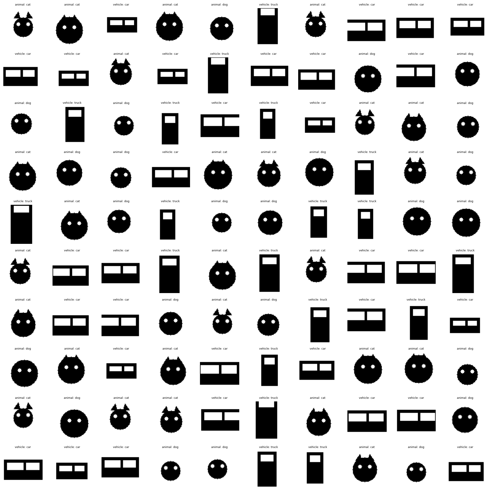

# Hierarchical Diffusion: Understanding Mode Collapse in Conditional Generation

[](LICENSE)
[](https://www.python.org/downloads/)
[](https://pytorch.org/)

> **An educational framework for understanding how hierarchical latent variables prevent mode collapse in conditional diffusion models.**

<p align="center">
  
</p>

## 🎯 What is This?

This is a hands-on learning project that demonstrates a fundamental problem in conditional generative modeling: **mode collapse**. You'll implement key components of two diffusion models and empirically observe how hierarchical structure prevents models from collapsing to a single mode.

**Perfect for:**
- Graduate students studying generative models
- Researchers exploring hierarchical diffusion
- Anyone wanting to deeply understand mode collapse beyond theory

**What you'll learn:**
- Why expressive models still collapse under conditional generation
- How hierarchical latent variables preserve semantic diversity
- Practical implementation of diffusion priors and decoders
- Quantitative evaluation of mode coverage and diversity

## 🚀 Quick Start

```bash
# Install dependencies
pip install -r requirements.txt

# Visualize the synthetic dataset (100 samples showing hierarchy)
python -m data.synthetic_dataset

# Implement 5 TODO functions (see ASSIGNMENT.md), then:

# Train baseline model (will exhibit mode collapse)
python train.py --model flat --epochs 50

# Train hierarchical model (preserves diversity)
python train.py --model hierarchical --epochs 50

# Evaluate and compare
python evaluate.py --model flat --checkpoint outputs/flat_final.pt
python evaluate.py --model hierarchical --checkpoint outputs/hierarchical_final.pt
```

## 📖 The Problem

When training conditional generative models, even highly expressive decoders based on diffusion processess can collapse to generating only a single "typical" output per condition. This happens because **averaging over modes minimizes expected loss** better than properly representing multimodal distributions.

**Example:** Ask a model to "generate an animal" (high-level condition). The true distribution includes both dogs and cats, but the model only learns to generate dogs because that minimizes training loss.

## 💡 The Solution

Hierarchical diffusion models introduce explicit latent variables at intermediate levels:

```
z2 (condition) → z1 (latent subtype) → image
```

By factorizing generation into stages, the model explicitly learns **two separate objectives**: (1) the distribution over semantic modes via the prior $p(z_1|z_2)$, and (2) mode-specific generation via the decoder $p(\text{image}|z_1)$. This eliminates the conflicting gradients that cause a single network to collapse when faced with ambiguous conditioning.

The model:
1. First samples which semantic mode (dog/cat) via a diffusion prior
2. Then generates the image conditioned on that sampled mode

## 🏗️ Project Structure

```
hierarchical_diffusion/
├── 📖 README.md              # You are here
├── 📋 QUICKSTART.md          # Week-by-week implementation plan
├── 📝 ASSIGNMENT.md          # Detailed task instructions
├── 🔧 SETUP.md               # Installation and usage guide
│
├── data/                     # Synthetic dataset with known hierarchy
│   ├── synthetic_dataset.py  #   z2 (animal/vehicle) → z1 (dog/cat/car/truck) → image
│   └── __init__.py
│
├── models/                   # Neural network architectures
│   ├── image_denoiser.py     #   🎯 YOU IMPLEMENT: Image diffusion decoder
│   ├── latent_prior.py       #   🎯 YOU IMPLEMENT: Latent diffusion prior
│   ├── unet.py               #   Provided UNet backbone
│   └── time_embedding.py     #   Sinusoidal time embeddings
│
├── diffusion/                # Diffusion process utilities
│   └── diffusion_process.py  #   Forward/reverse processes, sampling
│
├── evaluation/               # Metrics and analysis
│   └── metrics.py            #   🎯 YOU IMPLEMENT: 3 evaluation metrics
│
├── training/                 # Training orchestration
│   └── trainer.py            #   Handles both flat and hierarchical training
│
├── train.py                  # Main training script
├── evaluate.py               # Evaluation and metric computation
└── sample.py                 # Generate samples from trained models
```

## 🎓 Your Implementation Tasks

You'll implement **5 key functions** (≈10-15 hours total):

### Neural Networks (6-8 hours)
1. **`ImageDenoiser.forward()`** - Denoise images conditioned on latent/category
2. **`LatentPrior.forward()`** - Diffusion prior over latent embeddings

### Evaluation Metrics (6-8 hours)
3. **`compute_mode_coverage()`** - Count distinct semantic modes recovered
4. **`compute_conditional_entropy()`** - Measure diversity in latent space
5. **`compute_kl_divergence()`** - Compare to ground truth distribution

Each function has detailed instructions, expected shapes, and hints in the code.

## 🔬 The Experiment

### Dataset: Synthetic Hierarchical Images

We generate 64×64 images from a controlled 3-level hierarchy:

- **z2** (high-level): Category - "animal" or "vehicle"  
- **z1** (mid-level): Subtype - dog/cat or car/truck  
- **z0** (low-level): Style - color, brightness, position, scale

Ground truth is known for all variables, enabling quantitative evaluation.

### Model A: Flat Conditional Diffusion (Baseline)

```python
# Conditioning: z2 only (e.g., "animal")
# Problem: Model collapses to single mode (only generates dogs)
```

**Expected behavior:** Mode collapse - generates only one subtype per category

### Model B: Hierarchical Diffusion

```python
# Stage 1: Prior samples z1 ~ p(z1 | z2)
# Stage 2: Decoder generates image ~ p(image | z1)
# Result: Both dogs AND cats are generated
```

**Expected behavior:** Full semantic diversity preserved

## 📊 Evaluation

Quantitative metrics automatically computed:

- **Mode Coverage**: What fraction of subtypes (dog/cat/car/truck) appear in samples?
- **Conditional Entropy**: H(z1 | z2) - measures diversity  
- **KL Divergence**: Distance from true distribution p(z1 | z2)
- **Visual Inspection**: Grid samples for qualitative assessment

## 🛠️ Technical Details

- **Framework**: PyTorch 2.0+
- **Training time**: ~30-60 minutes per model (GPU recommended, CPU works)
- **Dataset size**: 10,000 synthetic images (generated on-the-fly)
- **Model size**: Lightweight UNets (~5-10M parameters)

## 📚 Documentation

- **[GUIDE.md](GUIDE.md)** - Complete installation, implementation, and usage guide
- **[ASSIGNMENT.md](ASSIGNMENT.md)** - Detailed task descriptions with hints
- **[CONTRIBUTING.md](CONTRIBUTING.md)** - How to contribute to this project

## 🤝 Contributing

This is an educational project designed for self-study, but improvements are welcome:

- Bug fixes and clarifications
- Additional evaluation metrics
- Extended visualizations
- Documentation improvements

Please open issues or pull requests on GitHub.

## 📄 License

BSD 3-Clause License - see [LICENSE](LICENSE) file for details.

## 📬 Contact

**Author**: Matthew J. Bryan  
**Purpose**: Educational framework for studying mode collapse

---

⭐ **Star this repo** if you find it useful for learning about diffusion models!

*Ready to start? Head to [GUIDE.md](GUIDE.md) for complete setup and implementation instructions.*
